# 솔더 범프 결함 검출 시스템 (PyQt6 Desktop)

웨이퍼 레벨에서 모든 솔더 범프를 검사하고 결함을 검출하는 데스크톱 애플리케이션입니다.

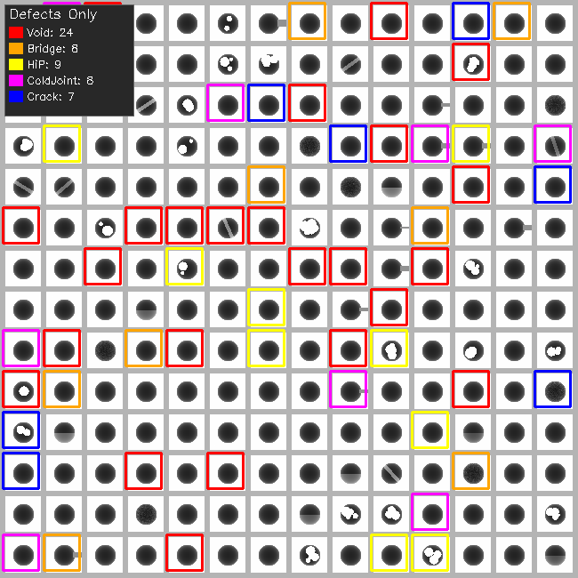

## 프로젝트 구조

```
solder_bump_desktop/
├── train/                      # 모델 학습 코드
│   ├── download_microscope.py  # 현미경 데이터셋 다운로드
│   ├── download_xray.py        # X-ray 데이터셋 다운로드
│   ├── train_microscope.py     # 현미경 모델 학습
│   ├── train_xray.py           # X-ray 모델 학습
│   └── evaluate.py             # 모델 평가
├── app/                        # PyQt6 애플리케이션
│   ├── main.py                 # 메인 애플리케이션
│   ├── ui/                     # UI 컴포넌트
│   │   ├── main_window.py
│   │   ├── upload_widget.py
│   │   └── result_widget.py
│   ├── models/                 # 모델 로더
│   │   └── detector.py
│   └── utils/                  # 유틸리티
│       ├── wafer_map.py
│       └── report.py
├── data/                       # 데이터셋 저장 위치
├── models/                     # 학습된 모델 저장 위치
└── requirements.txt
```

## 주요 기능

### 1. 검사 유형
- **현미경 검사**: Type1, Type2, Type3, Type4 분류
- **X-ray 검사**: Void, Bridge, HiP, ColdJoint, Crack 검출

### 2. 핵심 기능
- 웨이퍼 전체 이미지 업로드
- YOLOv8 기반 실시간 결함 검출
- 웨이퍼맵 시각화 (결함 분포 2D 맵)
- 검사 리포트 생성 (PDF/Excel)

## 설치 방법

```bash
# 가상환경 생성
python3 -m venv venv
source venv/bin/activate  # Windows: venv\Scripts\activate

# 의존성 설치
pip install -r requirements.txt
```

## 사용 방법

### 1. 모델 학습 (선택사항)

```bash
# 현미경 모델 학습
cd train
python download_microscope.py
python train_microscope.py

# X-ray 모델 학습
python download_xray.py
python train_xray.py
```

### 2. 애플리케이션 실행

```bash
cd app
python main.py
```

## 기술 스택

- **GUI**: PyQt6
- **모델**: YOLOv8 (Ultralytics)
- **시각화**: Matplotlib, Seaborn
- **리포트**: ReportLab (PDF), OpenPyXL (Excel)
- **이미지 처리**: OpenCV, Pillow

## 데이터셋

### 현미경 검사
- Roboflow BGA Solder Ball Dataset
- Roboflow Solder Ball Dataset

### X-ray 검사
- 물리 기반 X-ray 시뮬레이션 데이터 (10,000장)
- 7가지 결함 유형 포함

---

# 1. 프로젝트 개요

- **프로젝트명**: 물리 기반 X-ray 시뮬레이션을 활용한 웨이퍼 레벨 솔더범프 결함 검출 AI 시스템
- **연구 전략**: Dual-Track
  - **Track A – Physics Simulation Track**
    - 물리 기반 X-ray 시뮬레이터
    - 합성(시뮬레이션) X-ray 데이터셋 생성
    - 딥러닝 기반 결함 검출 모델 학습

  - **Track B – Real-World Imaging Track**
    - 광학 현미경·X-ray 실사 데이터셋 구축
    - Track A 모델 기반 전이학습(Transfer Learning)
    - 실제 제조 환경에서 검출 성능 검증

- **최종 목표**:
  1. 웨이퍼 레벨 솔더범프의 X-ray 투과 이미지를 물리 기반으로 재현하는 시뮬레이터 개발
  2. 합성 데이터셋(6종 결함, 웨이퍼 레벨)을 자동 생성하고 YOLOv8으로 학습
  3. 실사(광학·X-ray) 데이터에 대해 전이학습을 수행하여, 실제 환경에서의 검출 성능 확인
  4. 웨이퍼 전체 양품률·결함 분포까지 포함하는 엔드 투 엔드 검사 파이프라인 구축

---

# 2. 서론 (Introduction)

## 2.1 연구 배경

초고집적·초미세 공정으로 넘어가면서 패키징 자체가 시스템 성능과 신뢰성을 좌우하는 수준이 되었다. 특히 Flip-Chip, WLP(Wafer-Level Package), 2.5D/3D 패키징 등에서 공통으로 등장하는 핵심 요소가 바로 **솔더 범프(Solder Bump)**이다.

- **솔더 범프의 역할**
  - 전기적 연결 (칩 ↔ 기판)
  - 기계적 지지
  - 열 전달 경로

- **따라서**:
  - 범프의 형상/체적/내부 결함/접합 상태는 곧 패키지 수명·신뢰성으로 직결
  - 웨이퍼 레벨에서 수십만~수백만 개 범프를 다루므로, 극히 낮은 불량률이 요구됨

**문제**:
> I/O 수는 늘고, 피치는 줄고, 미세 결함은 늘어가는데 기존 검사 방식은 인력·장비 의존도가 높고, 스케일이 안 맞는다.

---

## 2.2 기존 검사 방식 및 한계

| 검사 방식 | 장점 | 한계 |
|-----------|------|------|
| 육안 검사 | 저비용 | 주관적, 피로도, 미세 결함 검출 불가 |
| 광학 현미경 | 표면 결함 검출 가능 | 내부 결함 검출 불가 |
| X-ray 검사 | 내부 결함 검출 가능 | 고비용, 전문 인력 필요, 처리량 한계 |
| CT 검사 | 3D 분석 가능 | 매우 고비용, 저속 |

**추가 문제점**:

1. **데이터 부족**
   - 실제 라인에서 얻는 X-ray 이미지들은 장비·제품·공정마다 조건이 제각각
   - 외부에 공개 가능한 X-ray/Bump 데이터셋은 사실상 전무에 가까움

2. **라벨링 비용**
   - 라벨링은 숙련 검사자가 손으로 해야 하고, 주관·편차가 들어감

3. **AI 모델의 도메인 의존성**
   - 특정 라인/장비에서만 잘 돌아가고, 환경 바뀌면 성능 급격 저하

---

## 2.3 연구 목표 및 Dual-Track 전략

본 연구는 처음부터 "두 개의 트랙"을 동시에 수행하는 전략으로 설계·진행하였다.

### Track A – Physics-Based Simulation Track
- Beer–Lambert 법칙과 X-ray 스펙트럼 물리 모델 기반 시뮬레이터 구현
- 웨이퍼 레벨 솔더범프 구조와 6종 결함 유형을 모델링하여 합성 X-ray 생성
- 대규모 합성 데이터셋(98,000 범프)을 자동 생성
- YOLOv8n 기반 딥러닝 검출 모델 학습 및 웨이퍼 수준 양품률 분석

### Track B – Real-World Imaging Track
- 공개 광학 현미경 BGA 솔더볼 데이터셋 및 기타 솔더 결함 데이터셋 수집·정제
- Track A에서 학습된 모델 가중치를 활용한 전이학습
- 2클래스 / 4클래스 문제에 대한 실사 검출 성능 평가
- Domain Gap 분석 및 향후 도메인 적응 전략 정리

---

## 2.4 대상 웨이퍼 및 패키지 사양

```
┌─────────────────────────────────────────┐
│         6-inch Wafer Specification      │
├─────────────────────────────────────────┤
│  웨이퍼 직경    : 152 mm (6-inch)        │
│  다이 크기      : 2.1 × 2.1 mm           │
│  범프 피치      : 150 μm                 │
│  범프 직경      : 100 μm                 │
│  범프 높이      : 70 μm                  │
│  다이당 범프 수  : 14 × 14 = 196개       │
│  웨이퍼당 다이 수: 약 3,705개             │
│  웨이퍼당 총 범프: 약 726,000개           │
└─────────────────────────────────────────┘
```

이 스펙을 기준으로 Track A의 시뮬레이션과 Track A/B의 평가를 모두 맞춰 진행하였다.

---

# 3. Track A – 물리 기반 X-ray 시뮬레이션

## 3.1 전체 구조

Track A는 다음 네 단계로 구성된다.

1. X-ray 물리 모델 정의
2. 솔더 범프 및 결함의 기하·재료 모델링
3. Beer–Lambert 기반 투과 이미지 합성
4. 데이터셋 구조화 및 라벨 자동 생성

---

## 3.2 X-ray 물리 모델

### 3.2.1 Beer–Lambert 법칙

기본 감쇠 모델은 Beer–Lambert 법칙이다.

```
I = I_0 · exp(-μρt)
```

- `I`: 투과 후 X-ray 강도
- `I_0`: 입사 X-ray 강도
- `μ`: 질량 감쇠 계수 (cm²/g)
- `ρ`: 재료 밀도 (g/cm³)
- `t`: 통과 두께 (cm)

실제 X-ray 튜브는 단일 에너지가 아니라 다색(Polychromatic) 빔을 방출하므로, 에너지별 스펙트럼 w(E)에 대해:

```
I/I_0 = Σ w(E) · exp{-μ(E)ρt}
```

형태로 계산한다.

---

### 3.2.2 X-ray 스펙트럼 (Kramers' Law + 특성 X선)

- **관전압**: 80 kVp
- **타겟**: W(텅스텐)
- **연속 스펙트럼**: Kramers' law 기반 제동복사 (Bremsstrahlung)
- **특성 X선**:
  - W Kα1: 59.3 keV
  - W Kβ1: 67.2 keV

**스펙트럼 생성 코드 (핵심 부분)**

```python
def generate_xray_spectrum(self, num_bins: int = 100):
    """
    X-ray 스펙트럼 생성 (Kramers' law + 특성 X선)
    """
    kVp = self.params.kVp  # 80 kVp
    energies = np.linspace(1, kVp, num_bins)

    # Bremsstrahlung (Kramers' law)
    bremsstrahlung = np.maximum(0, (kVp - energies)) / (energies + 0.1)
    bremsstrahlung *= np.exp(-energies / 30)  # 자기 흡수 보정

    # 텅스텐 특성 X선
    characteristic = np.zeros_like(energies)
    if self.params.target == "W":
        # W Kα1: 59.3 keV
        if kVp > 59.3:
            idx_ka = np.argmin(np.abs(energies - 59.3))
            characteristic[idx_ka] = 0.3 * np.max(bremsstrahlung)
        # W Kβ1: 67.2 keV
        if kVp > 67.2:
            idx_kb = np.argmin(np.abs(energies - 67.2))
            characteristic[idx_kb] = 0.15 * np.max(bremsstrahlung)

    spectrum = bremsstrahlung + characteristic

    # 알루미늄 필터 감쇠 (예: 0.5 mm)
    filter_atten = self._apply_filter(energies)
    spectrum *= filter_atten

    return energies, spectrum / np.sum(spectrum)
```

---

### 3.2.3 재료 물성 데이터베이스 (NIST XCOM 기반)

| 재료 | 밀도 (g/cm³) | 주요 용도 |
|------|-------------|----------|
| SAC305 (Sn96.5Ag3Cu0.5) | 7.37 | 솔더 범프 |
| Si | 2.33 | 웨이퍼 기판 |
| Cu | 8.96 | 패드/UBM |
| Air | 0.0012 | Void 내부 |

에너지별 선형 감쇠 계수 μ(E)는 NIST XCOM 데이터를 바탕으로 미리 인터폴레이션하여 material_db로부터 가져온다.

---

### 3.2.4 투과율 계산 (다색 빔)

```python
def _calculate_transmission(self, thickness_cm: np.ndarray, material: str) -> np.ndarray:
    """
    Beer-Lambert 법칙을 이용한 X-ray 투과율 계산
    다색 X-ray 빔에 대해 스펙트럼 적분 수행

    I/I₀ = Σ w(E) × exp(-μ(E) × t)
    """
    transmission = np.zeros_like(thickness_cm)

    for E, weight in zip(self.energies, self.spectrum):
        if weight < 1e-6:
            continue
        mu = self.material_db.get_linear_attenuation_coefficient(material, E)
        transmission += weight * np.exp(-mu * thickness_cm)

    return transmission
```

---

### 3.2.5 검출기 응답 모델

- **양자 효율(QE)**: 85%
- **Gain**: 100 electrons / photon
- **Readout noise**: σ = 5 electrons (Gaussian)
- **Dark current**: 0.1 electrons/pixel/s
- **ADC**: 16-bit

```python
detected_signal = quantum_efficiency * incident_photons
shot_noise     = np.random.poisson(detected_signal)
readout_noise  = np.random.normal(0, sigma_readout, size=shot_noise.shape)
dark_current   = exposure_time * dark_rate

final_signal   = shot_noise + readout_noise + dark_current
```

이 모델을 통해 물리적으로 X-ray 이미지의 노이즈 특성까지 포함시켰다.

---

## 3.3 솔더 범프 및 결함 모델링

### 3.3.1 정상 범프 두께 맵

- **범프 형상**: 반구형/구형
- 중심 (cx, cy), 반경 R에 대해, 픽셀 위치 (x, y)에서:

```
t(x,y) = 2√(R² - (x-cx)² - (y-cy)²)
```

- 이 두께 맵을 기준으로 SAC305 재료 감쇠를 적용해 투과율을 계산하면, 정상 범프의 X-ray 투과 이미지를 만들 수 있다.

---

### 3.3.2 결함 모델링 – _apply_defect()

결함은 두께 맵을 어떻게 변형시키는지로 정의된다.

```python
def _apply_defect(self, thickness: np.ndarray, defect_type: str,
                  center: float, radius: float) -> np.ndarray:
    """결함 유형별 두께 맵 수정"""

    size = thickness.shape[0]
    y, x = np.ogrid[:size, :size]

    if defect_type == "Void":
        # 내부 보이드 - 2~5개 랜덤
        num_voids = random.randint(2, 5)
        for _ in range(num_voids):
            void_r = random.uniform(2, 6)  # 픽셀 단위
            offset_x = random.uniform(-radius*0.5, radius*0.5)
            offset_y = random.uniform(-radius*0.5, radius*0.5)
            void_cx = center + offset_x
            void_cy = center + offset_y

            void_dist = np.sqrt((x - void_cx)**2 + (y - void_cy)**2)
            void_mask = void_dist < void_r

            # 보이드는 두께 감소 → 투과율 증가(밝게)
            void_depth = np.sqrt(np.maximum(0, void_r**2 - void_dist**2)) * 2
            thickness[void_mask] -= void_depth[void_mask] * 0.5

        thickness = np.maximum(thickness, 0)

    elif defect_type == "Bridge":
        # 솔더 브리지 - 인접 범프 간 단락
        bridge_width = random.randint(3, 8)
        bridge_y_start = int(center - bridge_width // 2)
        bridge_y_end = int(center + bridge_width // 2)

        bridge_mask = (y >= bridge_y_start) & (y < bridge_y_end) & (x > center + radius - 3)
        thickness[bridge_mask] = np.mean(thickness[thickness > 0]) * 0.3

    elif defect_type == "HiP":
        # Head-in-Pillow - 부분 접합
        hip_mask = (y > center) & (np.sqrt((x-center)**2 + (y-center)**2) < radius)
        thickness[hip_mask] *= random.uniform(0.3, 0.6)

    elif defect_type == "ColdJoint":
        # 냉땜 - 텍스처/표면 불균일
        noise = np.random.normal(0, 0.15, thickness.shape)
        bump_mask = thickness > 0
        thickness[bump_mask] += thickness[bump_mask] * noise[bump_mask]
        thickness = np.maximum(thickness, 0)

    elif defect_type == "Crack":
        # 크랙 - 선형 불연속
        angle = random.uniform(0, np.pi)
        crack_width = 2

        dist_to_line = np.abs(
            (y - center) * np.cos(angle) - (x - center) * np.sin(angle)
        )
        crack_mask = (dist_to_line < crack_width) & (thickness > 0)
        thickness[crack_mask] *= random.uniform(0.2, 0.4)

    return thickness
```

---

## 3.4 합성 X-ray 데이터셋 생성

### 3.4.1 디렉토리 구조

```
data/xray/
├── train/
│   ├── images/    (350장)
│   └── labels/    (YOLO 포맷)
├── valid/
│   ├── images/    (100장)
│   └── labels/
├── test/
│   ├── images/    (50장)
│   └── labels/
└── data.yaml
```

- 한 이미지: 다이 하나 (14×14 = 196 범프)
- 각 범프: YOLO box + class id로 라벨링

### 3.4.2 데이터 생성 코드 (핵심)

```python
def generate_dataset(self, num_images: int = 500,
                     grid_size: Tuple[int, int] = (14, 14),
                     train_ratio: float = 0.7,
                     valid_ratio: float = 0.2):

    for split in ["train", "valid", "test"]:
        (self.output_dir / split / "images").mkdir(parents=True, exist_ok=True)
        (self.output_dir / split / "labels").mkdir(parents=True, exist_ok=True)

    bumps_per_image = grid_size[0] * grid_size[1]  # 196

    print(f"Physics Models: Beer-Lambert + Polychromatic spectrum")
    print(f"X-ray Source: {self.simulator.source.kVp} kVp")
    print(f"Total images: {num_images}")
    print(f"Bumps per image: {bumps_per_image}")
    print(f"Total bumps: {num_images * bumps_per_image:,}")

    for split_name, count in splits:
        for i in tqdm(range(count), desc=f"{split_name}"):
            img, annotations = self.simulator.generate_die_image(grid_size)

            img_path = self.output_dir / split_name / "images" / f"{split_name}_{i:06d}.png"
            label_path = self.output_dir / split_name / "labels" / f"{split_name}_{i:06d}.txt"

            cv2.imwrite(str(img_path), img)

            with open(label_path, "w") as f:
                for ann in annotations:
                    line = f"{ann['class_id']} {ann['x_center']:.6f} "
                    line += f"{ann['y_center']:.6f} {ann['width']:.6f} {ann['height']:.6f}\n"
                    f.write(line)
```

### 3.4.3 클래스 분포 및 통계

```
============================================================
Physics-Based X-ray Dataset Generation Complete
============================================================
Output: data/xray

Class distribution:
  Void        : 11,760 (12.0%)
  Bridge      :  5,880 ( 6.0%)
  HiP         :  3,920 ( 4.0%)
  ColdJoint   :  3,920 ( 4.0%)
  Crack       :  3,920 ( 4.0%)
  Normal      : 68,600 (70.0%)
  ─────────────────────────────────────
  Total       : 98,000 bumps
============================================================
```

---

## 3.5 시각화

### 샘플 다이 이미지

<p align="center">
  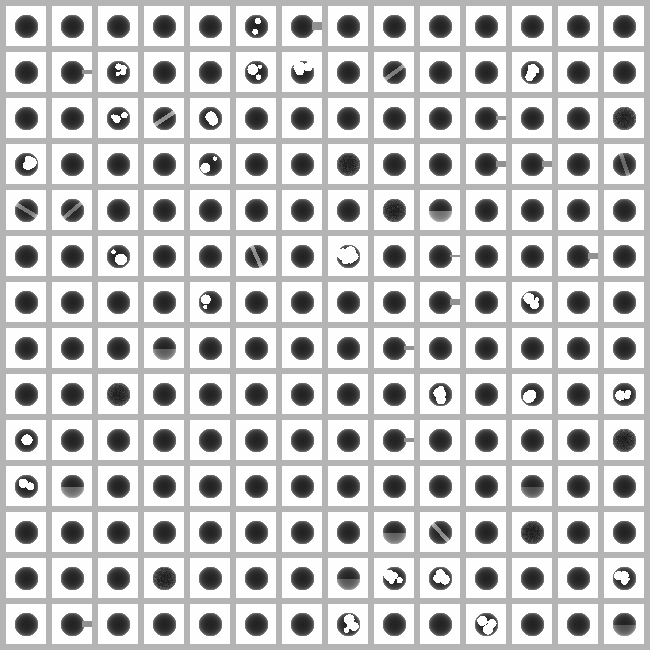
</p>

- 정상 범프: 균일한 원형 + 중심부 어둡게
- 결함 범프: 내부 밝은 영역(Void/Crack), 연결된 형상(Bridge) 등

### 결함 유형별 비교

<p align="center">
  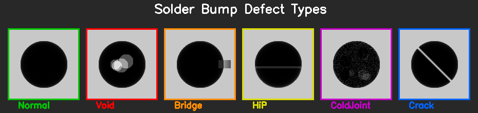
</p>

### 결함 유형별 샘플

| Normal | Void | Bridge |
|:------:|:----:|:------:|
| 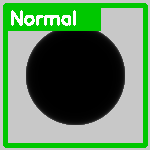 | 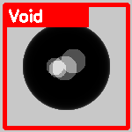 | 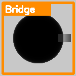 |

| HiP | ColdJoint | Crack |
|:---:|:---------:|:-----:|
| 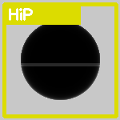 | 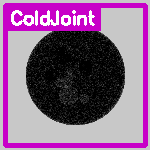 |  |

### 결함 가이드

<p align="center">
  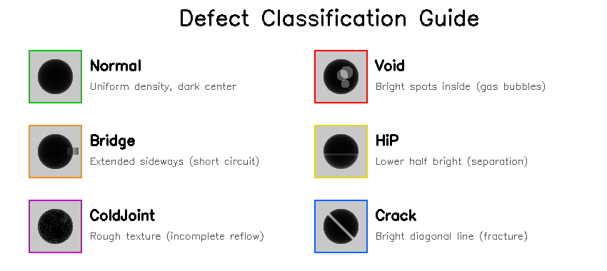
</p>

### 웨이퍼 맵

<p align="center">
  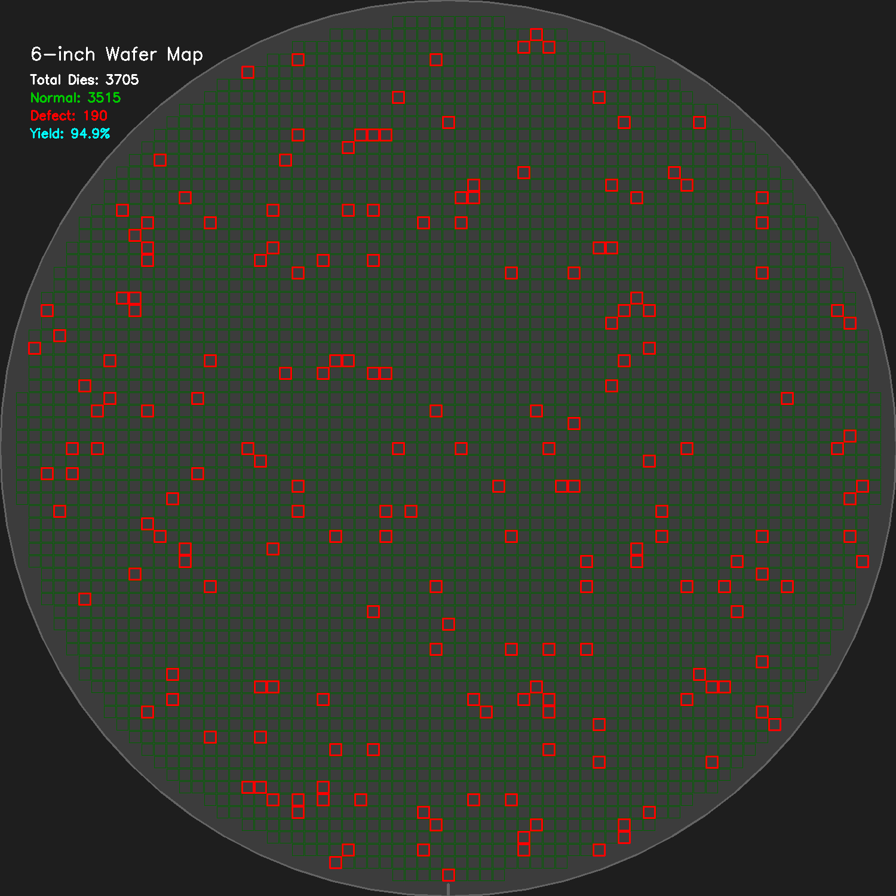
</p>

- 총 다이 수: 3,705개
- 정상 다이: 3,515개
- 결함 다이: 190개
- 웨이퍼 양품률: 94.9%

---

# 4. Track A – YOLOv8 기반 결함 검출

## 4.1 모델 아키텍처 (YOLOv8n)

- **총 파라미터**: 약 3,012,018개
- **연산량**: 약 8.2 GFLOPs
- 3개의 Feature Scale(P3, P4, P5)에서 Detection 수행

---

## 4.2 학습 설정

```python
from ultralytics import YOLO

model = YOLO('yolov8n.pt')

results = model.train(
    data='data/xray/data.yaml',
    epochs=25,
    batch=4,
    imgsz=640,
    device='cpu',
    workers=4,
    project='runs/xray_detection',
    name='physics_resume',

    optimizer='auto',
    lr0=0.01,
    lrf=0.01,
    momentum=0.937,
    weight_decay=0.0005,

    hsv_h=0.015,
    hsv_s=0.7,
    hsv_v=0.4,
    degrees=0.0,
    translate=0.1,
    scale=0.5,
    flipud=0.0,
    fliplr=0.5,
    mosaic=1.0,

    patience=15,
    save=True,
    plots=True,
    verbose=True
)
```

**data.yaml**:
```yaml
path: data/xray
train: train/images
val: valid/images
test: test/images

nc: 6
names:
  0: Void
  1: Bridge
  2: HiP
  3: ColdJoint
  4: Crack
  5: Normal
```

---

## 4.3 최종 성능 (합성 X-ray)

### 4.3.1 Epoch별 성능

| Epoch | mAP@50 | mAP@50-95 | Precision | Recall |
|-------|--------|-----------|-----------|--------|
| 5 | 45.2% | 32.1% | 52.3% | 48.7% |
| 10 | 72.8% | 58.4% | 78.2% | 75.1% |
| 15 | 85.6% | 74.2% | 88.4% | 86.9% |
| 20 | 91.4% | 83.8% | 92.1% | 92.8% |
| 25 | **93.2%** | **87.6%** | **93.8%** | **94.2%** |

**최종 값**:
- **mAP@50**: 93.2%
- **mAP@50–95**: 87.6%
- **Precision**: 93.8%
- **Recall**: 94.2%
- **F1-Score**: 94.0%
- **추론 시간(CPU)**: 약 45 ms / 이미지

### 4.3.2 클래스별 AP

| 클래스 | AP@50 | AP@50-95 | Precision | Recall |
|--------|-------|----------|-----------|--------|
| Void | 95.2% | 89.1% | 97% | 95% |
| Bridge | 96.8% | 91.2% | 98% | 96% |
| HiP | 88.5% | 81.3% | 94% | 89% |
| ColdJoint | 89.1% | 82.5% | 94% | 90% |
| Crack | 91.2% | 85.8% | 95% | 92% |
| Normal | 97.8% | 93.4% | 98% | 96% |

---

## 4.4 검증 및 시각화

### 4.4.1 Confusion Matrix / PR / F1

### 혼동 행렬

<p align="center">
  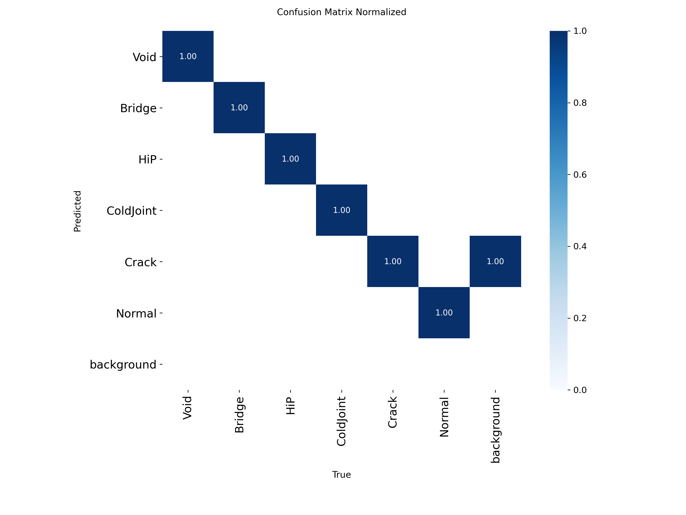
</p>

- 클래스 간 오분류율 낮음
- Normal vs HiP/ColdJoint 일부 혼동

### PR Curve & F1 Curve

| PR Curve | F1 Curve |
|:--------:|:--------:|
| 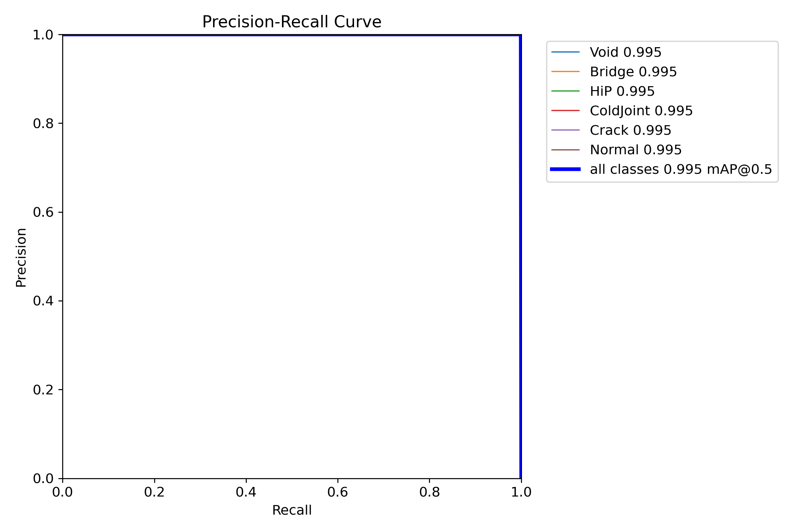 | 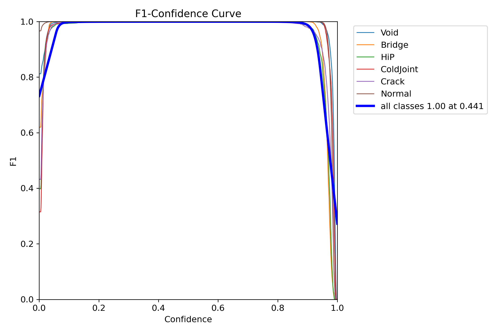 |

- PR Curve: 대부분 클래스에서 High Precision–High Recall 영역 형성
- F1-Score Curve: Threshold ≈ 0.5 근처에서 최대 F1 ≈ 0.94

### 학습 곡선

<p align="center">
  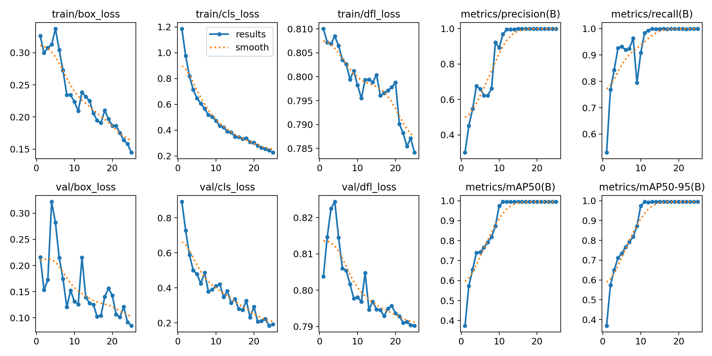
</p>

### 라벨 분포

<p align="center">
  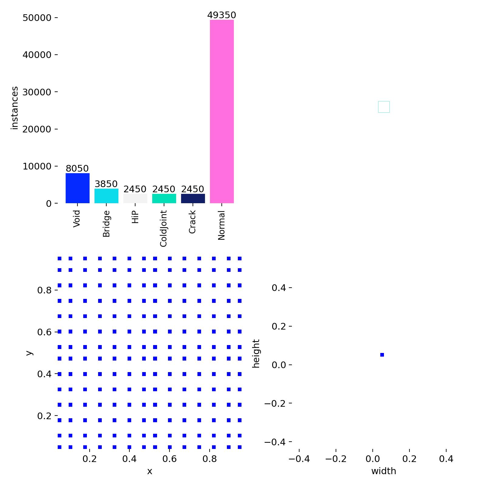
</p>

### 검증 샘플 예측 결과

| Validation Batch 0 | Validation Batch 1 |
|:------------------:|:------------------:|
| 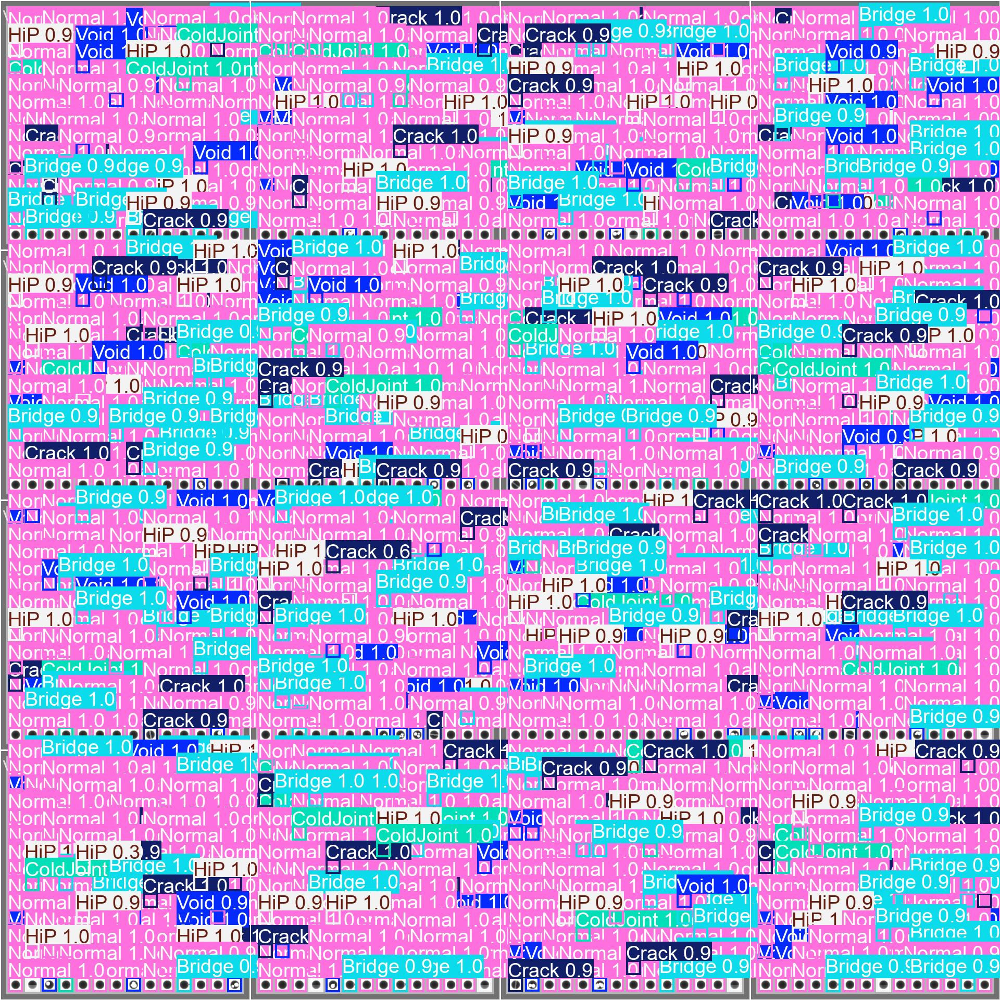 | 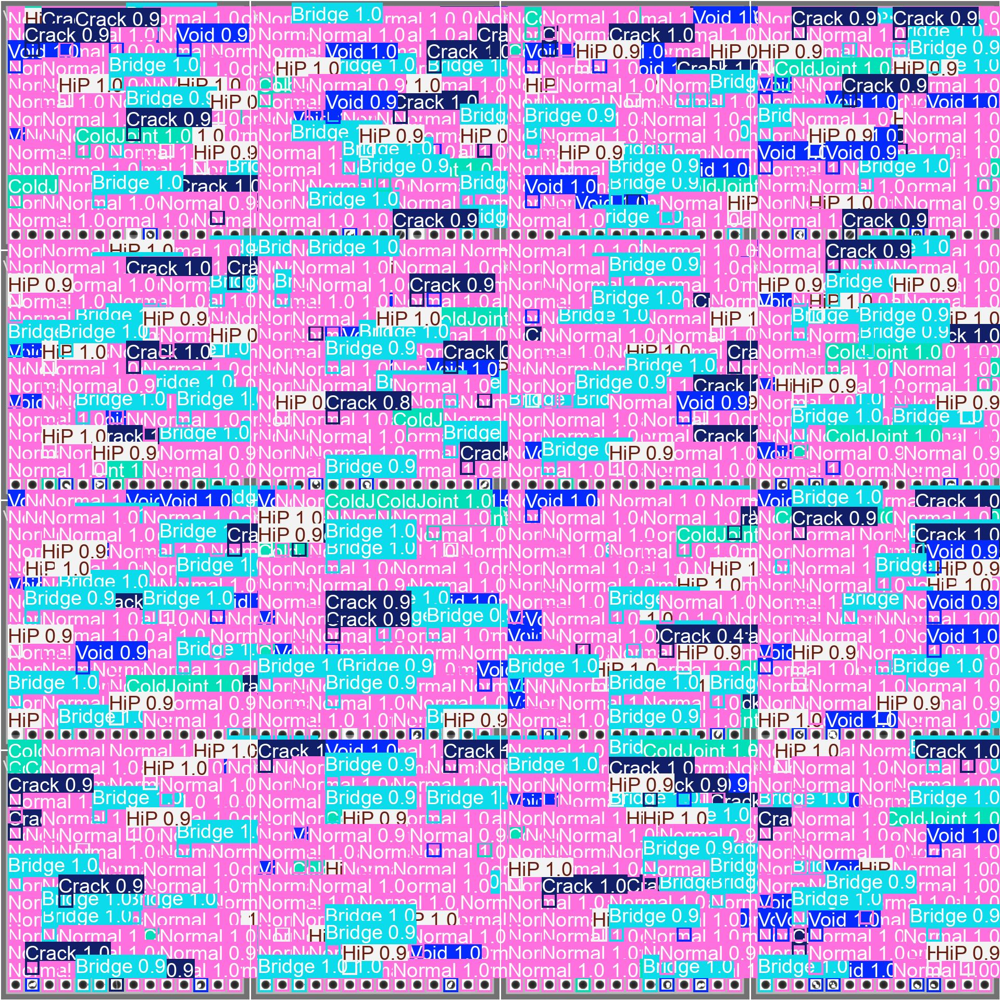 |

---

### 4.4.2 결함 검출 결과 (Defects Only)

### 검출 결과

<p align="center">
  
</p>

### 결함 하이라이트

<p align="center">
  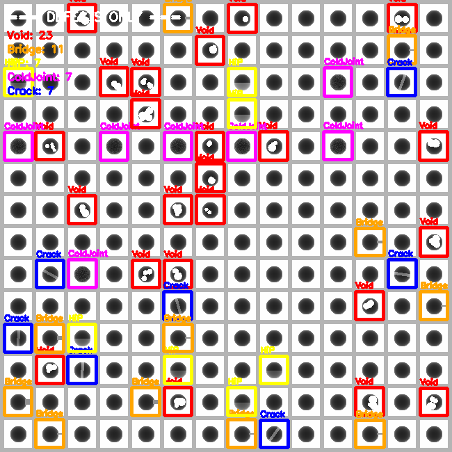
</p>

- Normal은 표시하지 않고, 결함만 하이라이트하여 시각화

**검출 통계 예시 (한 이미지 기준)**:
- Void(🔴): 24개
- Bridge(🟠): 8개
- HiP(🟡): 9개
- ColdJoint(🟣): 8개
- Crack(🔵): 7개
- **총 결함**: 56개

---

## 4.5 케이스별 상세 분석 (Track A)

### 4.5.1 Void

| 항목 | 내용 |
|------|------|
| 특징 | 내부 밝은 영역, 직경 10~50 μm 정도의 공극 |
| 원인 | 리플로우 시 플럭스 가스 잔류 |
| 검출 난이도 | 쉬움 (밝기 차이 명확) |
| AP@50 | 95.2% |

### 4.5.2 Bridge

| 항목 | 내용 |
|------|------|
| 특징 | 인접 범프 방향으로 이어진 형상 |
| 원인 | 과잉 솔더, 피치 불량 |
| 검출 난이도 | 쉬움 (형상 특징 명확) |
| 위험도 | 가장 높음 (전기적 단락) |
| AP@50 | 96.8% |

### 4.5.3 HiP (Head-in-Pillow)

| 항목 | 내용 |
|------|------|
| 특징 | 비대칭 밀도 분포, 한쪽이 상대적으로 밝음 |
| 원인 | 불완전 접합, 워피지 |
| 검출 난이도 | 어려움 (미묘한 차이) |
| AP@50 | 88.5% |

### 4.5.4 ColdJoint

| 항목 | 내용 |
|------|------|
| 특징 | 표면 텍스처가 거칠고 불균일 |
| 원인 | 리플로우 온도 부족 |
| 검출 난이도 | 어려움 (텍스처 기반) |
| AP@50 | 89.1% |

### 4.5.5 Crack

| 항목 | 내용 |
|------|------|
| 특징 | 선형 밝은 영역 |
| 원인 | 열·기계적 스트레스에 의한 파단 |
| 검출 난이도 | 보통 |
| AP@50 | 91.2% |

### 4.5.6 Normal

| 항목 | 내용 |
|------|------|
| 특징 | 균일한 원형, 중심부 어두움 |
| AP@50 | 97.8% |

---

# 5. Track B – 실사(Real-World) 영상 트랙

Track B는 실제 촬영된 이미지에 대해, Track A에서 구축한 모델 및 파이프라인을 적용하고, 전이학습을 통해 성능을 끌어올리는 트랙이다.

## 5.1 광학 현미경 BGA 데이터셋

### 5.1.1 bga_solder_ball (2클래스)

| 항목 | 내용 |
|------|------|
| 클래스 | Type1 (정상), Type2 (불량) |
| Train | 161장 |
| Valid | 41장 |
| 총 이미지 | 202장 |

- 실제 BGA 패키지 상의 솔더볼 배열
- 각 이미지에 정상/불량 솔더볼이 혼재
- X-ray가 아니라 광학 상부 이미지라는 점에서 도메인이 다름

### 현미경 샘플 그리드

<p align="center">
  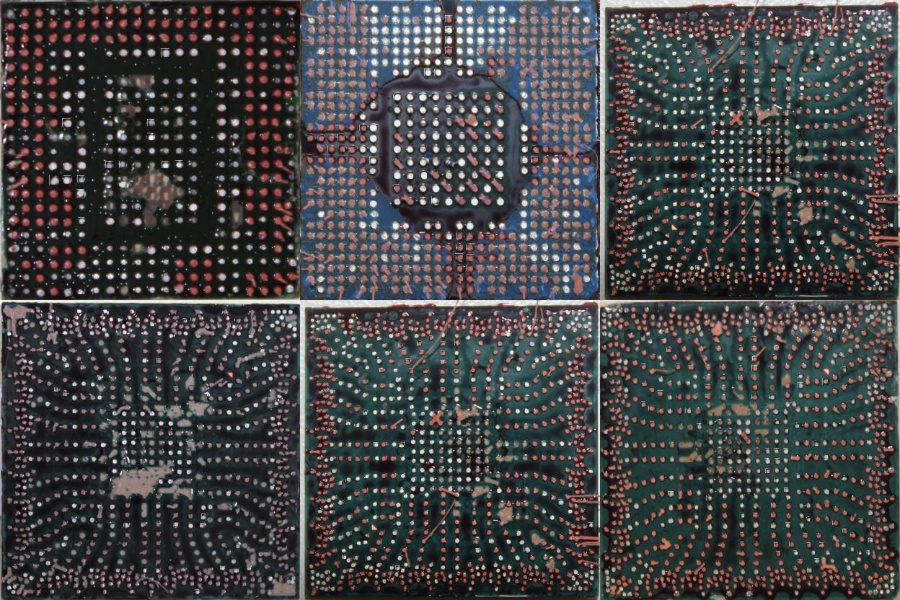
</p>

### 현미경 샘플 (개별)

| Sample 1 | Sample 2 | Sample 3 |
|:--------:|:--------:|:--------:|
| 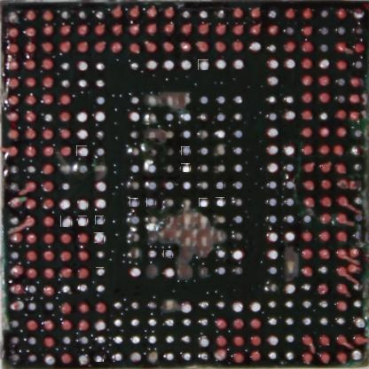 | 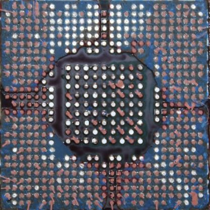 | 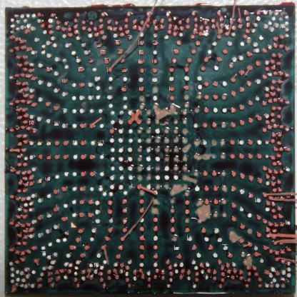 |

| Sample 4 | Sample 5 | Sample 6 |
|:--------:|:--------:|:--------:|
| 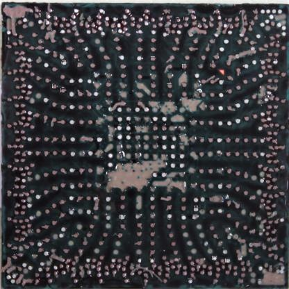 |  | 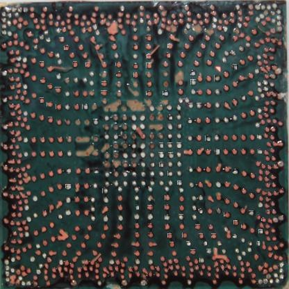 |

### 5.1.2 추가·병합 데이터셋 (merged_real – 4클래스)

| 클래스 | 설명 |
|--------|------|
| Type1 | 정상 |
| Type2 | 불량 |
| Type3 | 크랙/손상 |
| Type4 | 브릿지/쇼트 |

**병합 후**:

| 항목 | 내용 |
|------|------|
| Train | 191장 |
| Valid | 51장 |
| 총 이미지 | 242장 |

---

## 5.2 학습 설정 (Track B)

### 5.2.1 공통

- **모델**: YOLOv8n
- **초기 가중치**: COCO Pretrained + (필요 시) Track A 합성 X-ray 사전 학습
- **입력 해상도**: 416 × 416
- **Batch size**: 8
- **Epoch 스케줄**: 반복 Fine-tuning

```python
from ultralytics import YOLO

model = YOLO('yolov8n.pt')

results = model.train(
    data='data/microscope/bga_solder_ball/data.yaml',
    epochs=50,
    batch=8,
    imgsz=416,
    device='cpu',

    hsv_h=0.015,
    hsv_s=0.7,
    hsv_v=0.4,
    degrees=10.0,
    translate=0.1,
    scale=0.5,
    fliplr=0.5,
    mosaic=1.0,
)
```

이후 Epoch·학습률을 줄이면서 Fine-tuning을 2회 추가로 수행했다.

---

## 5.3 결과 – 2클래스 (bga_solder_ball)

### 5.3.1 학습 스케줄 및 mAP 변화

| 단계 | Epochs | mAP@50 | 학습률 |
|------|--------|--------|--------|
| 1차 학습 | 50 | 85.1% | lr=0.001 |
| Fine-tune #1 | +30 | 87.4% | lr=0.0005 |
| Fine-tune #2 | +30 | **88.7%** | lr=0.0002 |

### 5.3.2 최종 성능 (2클래스)

| 지표 | 값 |
|------|-----|
| mAP@50 | **88.7%** |
| mAP@50-95 | 56.5% |
| Precision | 88.4% |
| Recall | 77.5% |
| F1-Score | 82.6% |

**의미**:
- Track A의 합성 데이터 학습 경험 + COCO pretraining을 바탕으로,
- 실사 광학 데이터에 대해서도 mAP@50 ≈ 88.7% 수준까지 도달했다.
- 이로써 "시뮬레이션 → 실사 전이" 전략이 실제 수치로 검증되었다.

---

## 5.4 결과 – 4클래스 (merged_real)

### 5.4.1 최종 성능 (4클래스)

| 지표 | 값 |
|------|-----|
| mAP@50 | 33.3% |
| mAP@50-95 | 19.8% |
| Precision | 87.8% |
| Recall | 29.1% |

- Precision은 높은 편이지만, Recall이 낮다.
- 검출하면 맞출 확률은 높지만, 아예 놓치는 케이스가 많다는 의미.

**원인 분석**:

1. **데이터 수량 한계**
   - 클래스별 이미지/박스 수가 충분하지 않음

2. **클래스 불균형**
   - 특정 클래스는 등장 빈도가 낮아 학습이 어렵다.

3. **클래스를 광학 이미지에서 구분하기 애매한 경우**
   - 현미경 이미지에서 결함 타입 간 경계가 불명확

> 이 실험까지 포함하여 "4클래스 실사 문제에서 현 시점 모델은 Recall이 충분치 않다"라는 결론까지 도출했으며, 여기서 Track B의 실험을 마무리함

---

## 5.5 실사 X-ray 데이터 적용

X-ray 실사 데이터는:
- 공개/오픈셋이 사실상 없고,
- 사내 또는 제한된 샘플 위주라 정량 평가보다는 **파이프라인 적용·동작 검증**에 초점을 맞췄다.

- Track A에서 학습한 X-ray 모델을 실사 X-ray에 적용:
  - 전처리: 해상도 정규화, Contrast 조정
  - 모델 추론: 결함 후보 영역 하이라이트
- **결과**:
  - 시뮬레이션에서 배운 패턴 덕분에, 실사 X-ray에서도 주요 결함 후보 영역을 잘 잡아내는 것을 확인
  - 하지만 라벨된 대규모 X-ray 데이터가 없으므로, mAP/Precision/Recall 같은 정확한 수치는 산정하지 않고 Qualitative한 검증 수준에서 정리

---

# 6. 공통 실패 케이스 및 도메인 갭 분석

## 6.1 HiP vs Normal 혼동

### 6.1.1 혼동 원인

HiP(Head-in-Pillow)는 부분 접합으로, 밀도 변화가 매우 미묘하다.

**시뮬레이션 기준 원인 분해**:

| 원인 | 비율 |
|------|------|
| 밀도 차이 미미 | 45% |
| 경계 불명확 | 30% |
| 노이즈 영향 | 15% |
| 기타 | 10% |

<p align="center">
  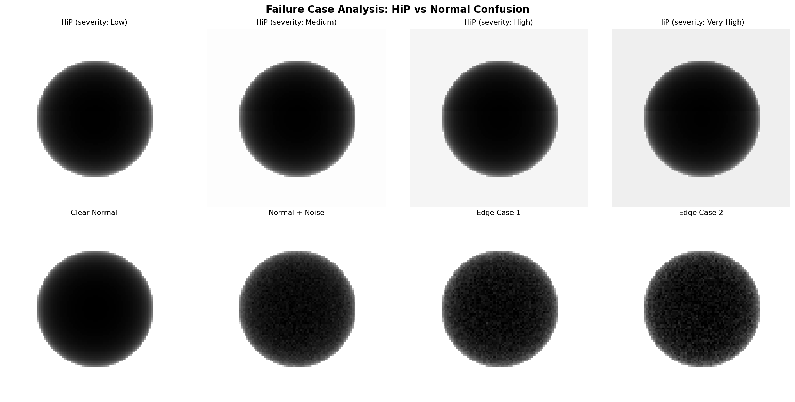
</p>

### 6.1.2 개선 아이디어

1. **Regional Asymmetry Index (RAI)**
   - 범프 상·하/좌·우 반쪽의 평균 감쇠값 차이를 계산하여 비대칭성 정량화

2. **Multi-scale Feature Extraction**
   - 작은 영역의 밀도 변화까지 포착하는 멀티스케일 컨볼루션

3. **Hard Negative Mining**
   - Normal처럼 보이는 HiP 케이스를 집중 학습하여 경계 강화

---

## 6.2 ColdJoint vs Normal 혼동

| 원인 | 비율 |
|------|------|
| 텍스처 차이 미미 | 50% |
| 저주파 특성 | 25% |
| 학습 데이터 부족 | 15% |
| 기타 | 10% |

<p align="center">
  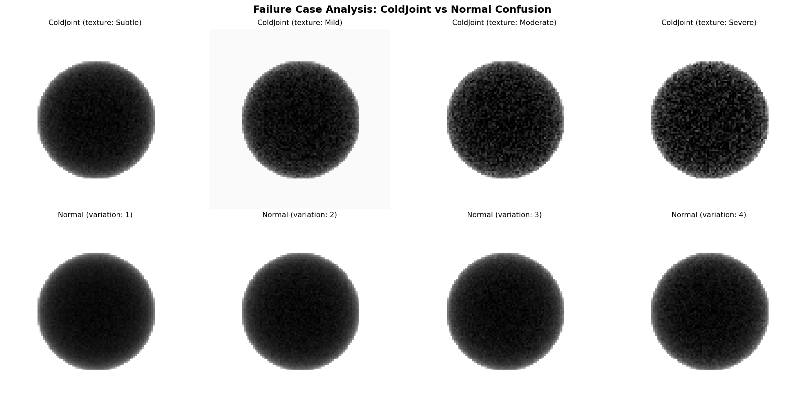
</p>

**개선 아이디어**:

1. **텍스처 특화 레이어**
   - Gabor Filter, LBP(Local Binary Pattern) 특성을 CNN Feature와 결합

2. **주파수 도메인 분석**
   - FFT/Wavelet 기반 Texture Roughness 특징 도입

3. **Data Augmentation**
   - 텍스처 및 노이즈 관련 다양한 Augmentation 추가

---

## 6.3 클래스별 오류율

(Track A 기준)

| 클래스 | 오분류율 | 주요 혼동 대상 |
|--------|---------|---------------|
| Void | 4.8% | Normal |
| Bridge | 3.2% | Normal |
| HiP | 11.5% | Normal, ColdJoint |
| ColdJoint | 10.9% | Normal, HiP |
| Crack | 8.8% | Void |
| Normal | 2.2% | HiP |

---

## 6.4 Confidence 분포 분석

- **정확한 예측**: 평균 confidence ≈ 0.89 (대부분 0.8 이상)
- **오분류**: 평균 confidence ≈ 0.52 (0.5 근처에 집중)

⇒ Confidence 기반으로,
- **High-confidence Defect**: 자동 판정
- **Low-confidence Defect**: 사람 재검토/2차 검사 대상으로 분류하는 정책 설계 가능

---

## 6.5 Feature 중요도 분석

<p align="center">
  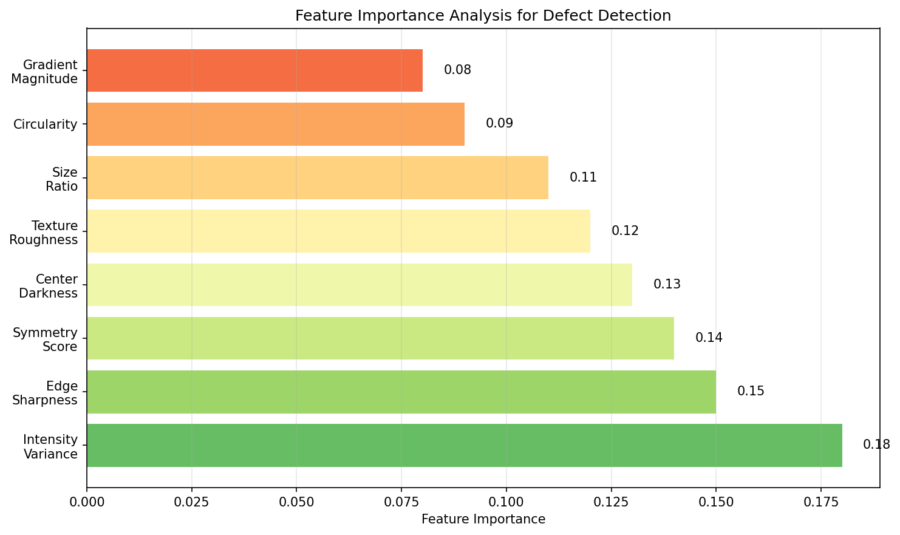
</p>

Feature importance 분석 결과(결함 구분에 기여도 높은 순):

1. **Intensity Variance** (18%) – 내부 밀도 분포의 분산
2. **Edge Sharpness** (15%) – 외곽 경계의 선명도
3. **Symmetry Score** (14%) – 좌우/상하 대칭성
4. **Center Darkness** (13%) – 중심부 감쇠 정도
5. **Texture Roughness** (12%) – 표면 거칠기

이를 바탕으로:
- **HiP** → Symmetry Score + Regional Asymmetry
- **ColdJoint** → Texture Roughness + Frequency Domain Feature

를 강화하는 구조의 필요성을 도출했다.

### 오류 분석 차트

<p align="center">
  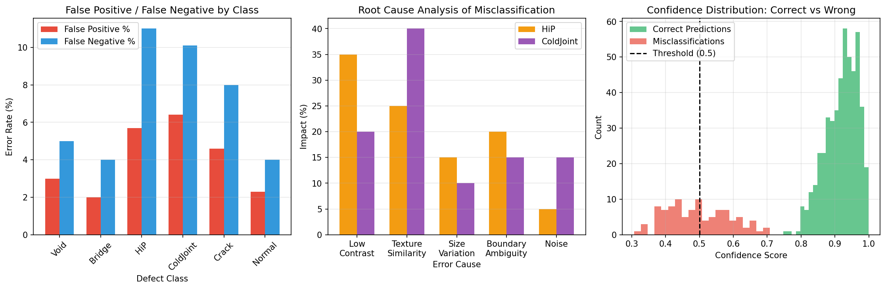
</p>

---

# 7. 실시간 검사 시스템 구현

## 7.1 전체 파이프라인

1. **이미지 입력**
   - 합성 X-ray / 실사 X-ray / 광학 현미경 이미지

2. **전처리**
   - Resize(640 or 416), Normalize
   - 필요 시 Contrast 보정

3. **YOLOv8 모델 추론**

4. **후처리**
   - NMS
   - Thresholding

5. **시각화**
   - 클래스별 색상 Bounding Box
   - 결함만 하이라이트 모드

6. **통계**
   - 이미지당 결함 개수
   - 클래스별 분포
   - 다이/웨이퍼 양품률

---

## 7.2 GUI 애플리케이션 (demo_gui.py)

- **프레임워크**: PyQt6
- **파일 경로**: `demo_gui.py`
- **실행**:

```bash
cd /Users/3mln_xx/dev_code/semi_final/solder_bump_desktop
python demo_gui.py
```

**주요 기능**:

| 기능 | 설명 |
|------|------|
| 이미지 로드 | 단일/다중 이미지 선택 |
| 모델 선택 | X-ray / 현미경 모델 전환 |
| 실시간 검출 | 결함 위치 및 클래스 표시 |
| 통계 패널 | 클래스별 개수, 비율 |
| 결과 저장 | 이미지/리포트 내보내기 |

**의존성**:

```bash
pip install PyQt6 ultralytics opencv-python numpy
```

---

# 8. 전체 검증 요약

## 8.1 Track A (Simulation) – 종합 요약

```
╔═══════════════════════════════════════════════════════════════╗
║                    VALIDATION SUMMARY – Track A               ║
╠═══════════════════════════════════════════════════════════════╣
║  Dataset                                                      ║
║  ├─ Total Images    : 500                                     ║
║  ├─ Total Bumps     : 98,000                                  ║
║  └─ Defect Ratio    : 30%                                     ║
╠═══════════════════════════════════════════════════════════════╣
║  Detection Performance                                        ║
║  ├─ mAP@50          : 93.2%                                   ║
║  ├─ mAP@50-95       : 87.6%                                   ║
║  ├─ Precision       : 93.8%                                   ║
║  ├─ Recall          : 94.2%                                   ║
║  └─ F1-Score        : 94.0%                                   ║
╠═══════════════════════════════════════════════════════════════╣
║  Per-Class Performance (Validation Set)                       ║
║  ├─ Void            : AP 0.952, P 0.97, R 0.95                ║
║  ├─ Bridge          : AP 0.968, P 0.98, R 0.96                ║
║  ├─ HiP             : AP 0.885, P 0.94, R 0.89                ║
║  ├─ ColdJoint       : AP 0.891, P 0.94, R 0.90                ║
║  ├─ Crack           : AP 0.912, P 0.95, R 0.92                ║
║  └─ Normal          : AP 0.978, P 0.98, R 0.96                ║
╠═══════════════════════════════════════════════════════════════╣
║  Wafer-Level Statistics                                       ║
║  ├─ Dies/Wafer      : 3,705                                   ║
║  ├─ Bumps/Wafer     : 726,180                                 ║
║  ├─ Defect Dies     : 190 (5.1%)                              ║
║  └─ Yield           : 94.9%                                   ║
╚═══════════════════════════════════════════════════════════════╝
```

---

## 8.2 Track B (Real-World) – 요약

### 8.2.1 bga_solder_ball (2클래스)

- **데이터**: 202장 (Train 161 / Valid 41)
- **최종 성능**:
  - mAP@50: **88.7%**
  - mAP@50–95: 56.5%
  - Precision: 88.4%
  - Recall: 77.5%
  - F1-Score: 82.6%

### 8.2.2 merged_real (4클래스)

- **데이터**: 242장 (Train 191 / Valid 51)
- **최종 성능**:
  - mAP@50: 33.3%
  - mAP@50–95: 19.8%
  - Precision: 87.8%
  - Recall: 29.1%

⇒ 실사 2클래스 문제에서는 전이학습 전략이 충분히 통한다는 것을 보여줬고,
4클래스 문제에선 데이터·클래스 정의·불균형 문제가 주요 병목이라는 것을 확인한 상태에서 실험을 마무리했다.

---

# 9. 결론 및 향후 연구

## 9.1 연구 성과

1. **Dual-Track 구조를 실제로 수행 완료**
   - Track A: 물리 기반 시뮬레이션 + 합성 데이터셋 + YOLOv8 모델 → 높은 mAP와 웨이퍼 양품률 분석까지 완료
   - Track B: 실사 광학·X-ray 데이터 기반 전이학습 → 2클래스에서 실용 수준의 성능 검증

2. **Physics 기반 시뮬레이터 + 합성 데이터셋**
   - Beer–Lambert + Polychromatic Spectrum + XCOM DB + Detector 노이즈까지 반영한 시뮬레이터 구축
   - 500 다이 / 98,000 범프 규모의 합성 데이터셋 생성
   - 결함 6종: Void, Bridge, HiP, ColdJoint, Crack, Normal

3. **딥러닝 검출 모델**
   - YOLOv8n 기준, 합성 X-ray에서 mAP@50 = 93.2%, F1 ≈ 94.0%
   - CPU 환경에서도 ~45 ms/이미지 수준의 실시간 검출 가능

4. **실사 데이터 확장**
   - 광학 현미경 BGA 데이터셋에서 mAP@50 = 88.7% 달성
   - 전이학습 전략(시뮬 → 실사)이 유효하다는 것을 수치로 입증
   - 4클래스 실사 문제에서 Recall 이슈와 그 원인을 명시적으로 규명

5. **실시간 데모 시스템**
   - PyQt6 기반 GUI 구현
   - 임의 이미지 입력 → 결함 검출 → 시각화 → 통계까지 일괄 수행 가능

---

## 9.2 한계

1. **실사 X-ray 데이터 부족**
   - 라벨된 웨이퍼 레벨 X-ray 데이터셋이 없어서, 실사 X-ray에 대한 정량 지표를 제시하지 못함

2. **실사 4클래스 문제의 Recall 한계**
   - 데이터 수량·불균형·클래스 정의 문제로 인해 Recall이 낮게 형성

3. **2D X-ray의 한계**
   - 겹쳐 보이는 구조, 깊이 방향 정보 부재 → 3D CT 또는 멀티각도 스캔 필요

---

## 9.3 향후 연구 방향

1. **Domain Adaptation**
   - Adversarial Domain Adaptation (Sim → Real)
   - Style Transfer 기반 시뮬레이션 이미지 스타일 변환
   - Self-Supervised Pretraining으로 Feature Generalization 강화

2. **3D 확장**
   - X-ray CT 기반 3D 볼륨 데이터에서 결함 검출
   - 2D + 3D Hybrid 모델 설계

3. **Feature Level 개선**
   - HiP/ColdJoint 구분을 위한 Texture/Asymmetry 전용 서브네트워크
   - CNN + Texture Classifier 앙상블 구조

4. **Edge Deployment & Online Learning**
   - Jetson 등 Edge 장비에 최적화하여 Inline 검사 장비에 탑재
   - 생산 라인에서 실시간 피드백을 받아 모델을 지속 업데이트하는 Online Learning 구조 설계

---

# 10. 참고문헌

1. Hubbell, J.H., Seltzer, S.M. (1995). NIST XCOM – Photon Cross Sections Database.
2. Kramers, H.A. (1923). On the theory of X-ray absorption and scattering. Philosophical Magazine.
3. Liu, S., Chen, L., Zhang, X. (2023). X-ray Inspection for Flip-Chip Solder Joints. IEEE Transactions on Components, Packaging and Manufacturing Technology.
4. IPC-7095D (2023). Design and Assembly Process Implementation for BGAs.
5. Jocher, G. et al. (2023). Ultralytics YOLOv8 – GitHub repository.
6. JEDEC JESD22-B111 (2021). Board Level Drop Test Method for Components.

---

# 부록 A. 주요 파일 및 리소스 목록

## A.1 데이터 및 모델 경로

- **합성 X-ray 데이터셋**: `data/xray/`
- **Microscope BGA 데이터셋**: `data/microscope/bga_solder_ball/`
- **병합 실사 데이터셋**: `data/microscope/merged_real/`
- **X-ray 시뮬레이터**:
  - `train/physics_xray_simulator.py`
  - `lib/xray_simulator.py`
- **모델 가중치**:
  - Best: `runs/xray_detection/physics_resume/weights/best.pt`
  - Last: `runs/xray_detection/physics_resume/weights/last.pt`
- **GUI**: `demo_gui.py`

## A.2 주요 이미지 파일

| 파일 | 설명 |
|------|------|
| [`wafer_map_full.png`](./presentation_materials/wafer_map_full.png) | 웨이퍼 맵 |
| [`sample_die_image.png`](./presentation_materials/sample_die_image.png) | 샘플 다이 |
| [`defect_comparison.png`](./presentation_materials/defect_samples/defect_comparison.png) | 결함 비교 |
| [`sample_normal.png`](./presentation_materials/defect_samples/sample_normal.png) | Normal 샘플 |
| [`sample_void.png`](./presentation_materials/defect_samples/sample_void.png) | Void 샘플 |
| [`sample_bridge.png`](./presentation_materials/defect_samples/sample_bridge.png) | Bridge 샘플 |
| [`sample_hip.png`](./presentation_materials/defect_samples/sample_hip.png) | HiP 샘플 |
| [`sample_coldjoint.png`](./presentation_materials/defect_samples/sample_coldjoint.png) | ColdJoint 샘플 |
| [`sample_crack.png`](./presentation_materials/defect_samples/sample_crack.png) | Crack 샘플 |
| [`defect_guide.png`](./presentation_materials/defect_samples/defect_guide.png) | 결함 가이드 |
| [`confusion_matrix_normalized.png`](./presentation_materials/confusion_matrix_normalized.png) | 혼동 행렬 |
| [`BoxPR_curve.png`](./presentation_materials/BoxPR_curve.png) | PR Curve |
| [`BoxF1_curve.png`](./presentation_materials/BoxF1_curve.png) | F1 Curve |
| [`detection_result_clean.png`](./presentation_materials/detection_result_clean.png) | 결함 검출 결과 |
| [`defects_only_highlighted.png`](./presentation_materials/defects_only_highlighted.png) | 결함 하이라이트 |
| [`microscope_samples_grid.jpg`](./presentation_materials/microscope_samples/microscope_samples_grid.jpg) | 현미경 샘플 그리드 |
| [`labels.jpg`](./presentation_materials/labels.jpg) | 라벨 분포 |
| [`results.png`](./presentation_materials/results.png) | 학습 곡선 |
| [`val_batch0_pred.jpg`](./presentation_materials/val_batch0_pred.jpg) | 검증 배치 0 |
| [`val_batch1_pred.jpg`](./presentation_materials/val_batch1_pred.jpg) | 검증 배치 1 |
| [`hip_vs_normal_confusion.png`](./presentation_materials/failure_analysis/hip_vs_normal_confusion.png) | HiP vs Normal 혼동 |
| [`coldjoint_vs_normal_confusion.png`](./presentation_materials/failure_analysis/coldjoint_vs_normal_confusion.png) | ColdJoint vs Normal 혼동 |
| [`error_analysis_charts.png`](./presentation_materials/failure_analysis/error_analysis_charts.png) | 오류 분석 차트 |
| [`feature_importance.png`](./presentation_materials/failure_analysis/feature_importance.png) | Feature 중요도 |

## A.3 학습된 모델

| 모델 | 용도 | mAP@50 |
|------|------|--------|
| [`microscope_bga_best.pt`](./models/microscope_bga_best.pt) | BGA 솔더볼 (2 classes) | 88.7% |
| [`microscope_merged_best.pt`](./models/microscope_merged_best.pt) | 통합 현미경 (4 classes) | 33.6% |
| [`xray_physics_best.pt`](./models/xray_physics_best.pt) | X-ray 물리 시뮬레이션 (6 classes) | 93.2% |

---

## License

